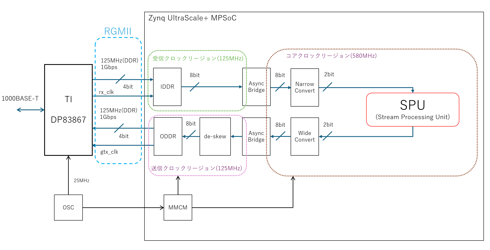
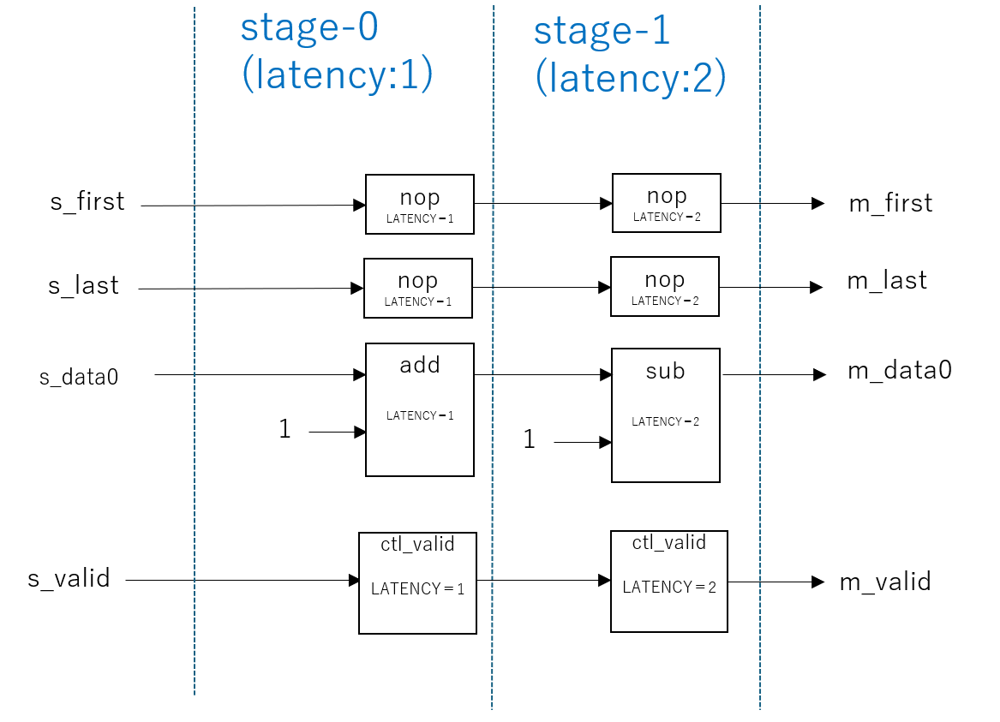
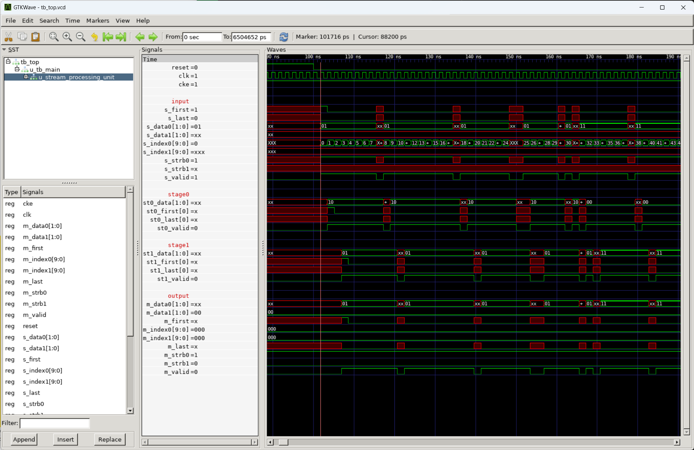

# 1G-Ether SPU サンプル

## 概要

1G-Ether の環境で SPU(ストリーミング・プロセッシング・ユニット) の評価を行うサンプルである。



1Gbps の Etherからの受信は 2bit 幅で SPU に入力され、SPU の出力はそのまま Ether での返信パケットとなる。

## 現状の環境

現状は KR260 にのみ対応している。

## Elixirで置き換えるべきコード

- [SPU相当のサンプル(stream_processing_unit.sv)](rtl/stream_processing_unit.sv)

Elixir からコンパイルされたコードはで上記を置き換える事を想定している。

現在は stage0 で 1 を加算した後に、stage1 で 1を減算して元に戻すだけの単純なサンプルとなっている。



stage1 の LATENCY は 1 で問題ないが、あくまでサンプルとして 2 を設定している。


## 事前準備

Vitis 2023.2 があらかじめ利用可能になっていること

```
source /tools/Xilinx/Vitis/2023.2/settings64.sh 
```

などを実行しておくこと。

また一部に [jelly](https://github.com/ryuz/jelly)を使う為、

```
git submodule update --recursive
```

などを実施して、サブモジュールをアップデートしておくこと。

なお、初回のみ

```
git submodule update --init --recursive
```

が必要。


## SPU単独のシミュレーション方法

sim/tb_stream_processing_unit 以下にシミュレーション環境がある。

input_data.txt を入力データとして 10 回繰り返し入力する。

結果は 実行したディレクトリに output_log.txt として出力される。


### verilator を使う方法

sim/tb_stream_processing_unit/verilator にて

```
make
```

とする。

### xsim を使う方法

sim/tb_stream_processing_unit/xsim にて

```
make
```
とする。

### verilator (C++版) を使う方法

sim/tb_stream_processing_unit/verilator_cpp にて

```
make
```

とする。

### シミュレーション波形

下記は不定値の使える xsim でのシミュレーション結果の例である。シミュレーション後に vcd ファイルが出力される。




## KR260 のトップネットからミュレーションする方法

### xsim を使う方法

kr260/sim/tb_top/xsim にて

```
make
```


## 合成方法

合成は Vivado の動く PC で行う。

kr260/syn/tcl にて

```
make
```

と打てば合成され  eval_ether_spu_kr260_tcl.runs/impl_1 に eval_ether_spu_kr260.bit が出来上がる。

ビルド時の最後に自動実行されるが、明示的に

```
make check_log
```

とすると、レポートを grep してワーニングを確認できるようにしている。
ワーニングは無視していいものが多いが、Critical Warnings が 0 でない場合は、タイミング収束が出来ていないなどの重要な問題が多い為、確認が必要である。

下記は正常時のサンプルである。

```
----- synth_1 -----
130 Infos, 166 Warnings, 0 Critical Warnings and 0 Errors encountered.
----- impl_1 -----
16 Infos, 1 Warnings, 0 Critical Warnings and 0 Errors encountered.
38 Infos, 1 Warnings, 0 Critical Warnings and 0 Errors encountered.
85 Infos, 1 Warnings, 0 Critical Warnings and 0 Errors encountered.
94 Infos, 1 Warnings, 0 Critical Warnings and 0 Errors encountered.
110 Infos, 1 Warnings, 0 Critical Warnings and 0 Errors encountered.
120 Infos, 2 Warnings, 0 Critical Warnings and 0 Errors encountered.
14 Infos, 1 Warnings, 0 Critical Warnings and 0 Errors encountered.
```

なお、 

```
make make_csv
```

で、各種集計用の csv を生成するが、利用しているスクリプトが python を用いているので、利用するには pandas などのライブラリのインストールが必要である。


## 実機実行方法

実機では SD カード上に同じ環境を clone すること。その際 submodule の update も忘れずに行う事。

まず kr260/app に eval_ether_spu_kr260.bit をコピーする

kv260/app にて

```
make run
```

と打てばビルド後に実行される

