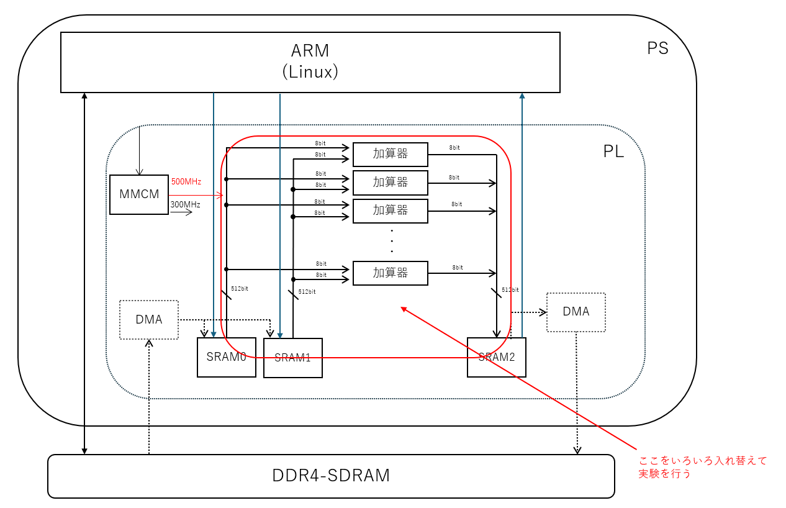

# SRAM to SRAM 演算評価

## 概要

SRAM から SRAM へのストリーム演算を 512bit幅 500MHz 以上などの高周波数で動作テストする。



SRAM としては、Block-SRAM などを利用する。

本来SRAMへは外部の DDR4-SDRAM 等から転送を行うが、評価においては PS の ARM コアから読み書きを行う。


## 現状の環境

現状 KV260 で 符号なし8bit 整数を 64並列(512bit)加算する実験環境のみ存在する

- eval_add512_u8/KV260


## 事前準備

Vitis 2023.2 があらかじめ利用可能になっていること

```
source /tools/Xilinx/Vitis/2023.2/settings64.sh 
```

などを実行しておくこと。

また一部に [jelly](https://github.com/ryuz/jelly)を使う為、

```
git submodule update --recursive
```

などを実施して、サブモジュールをアップデートしておくこと。

なお、初回のみ

```
git submodule update --init --recursive
```

が必要。


## シミュレーション方法

合成は Vivado の動く PC で行う。

### xsim を使う方法

eval_add512_u8/kv260/sim/tb_top/xsim にて

```
make
```


### verilator を使う方法

eval_add512_u8/kv260/sim/tb_top/verilator にて

```
make
```


## 合成方法

合成は Vivado の動く PC で行う。

eval_add512_u8/kv260/syn/tcl にて

```
make
```

と打てば合成され  eval_sram_to_sram_add_kv260_tcl.runs/impl_1 に eval_sram_to_sram_add_kv260.bit が出来上がる。


## 実機実行方法

実機では SD カード上に同じ環境を clone すること。その際 submodule の update も忘れずに行う事。

まず eval_add512_u8/kv260/app に eval_sram_to_sram_add_kv260.bit をコピーする

eval_add512_u8/kv260/app にて

```
make run
```

と打てばビルド後に実行される

