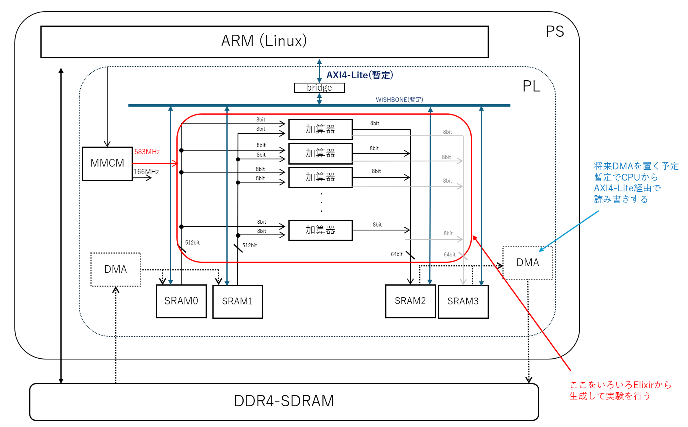

# SRAM to SRAM SPU サンプル

## 概要

Elixir から生成したコードをコマンドラインで合成まで行って、合成結果のレポートを得る手順を実験するためのサンプル。

まずはフローを確認するために下記のブロック図のような、１ステージしかない加算などの演算で実験する。



SPU(ストリーミング・プロセッシング・ユニット) の開発に先立って、SRAM から SRAM へのストリーム演算を
64bit幅で2入力2出六として 583MHz (KV260 の BRAMの上限を超えない生成可能最大周波数) などの高周波数で動作テストするサンプル。

SRAM としては、Block-SRAM を利用し、暫定で Host CPU から読み書きする。

本来SRAMへは外部の DDR4-SDRAM 等から転送を行うが、SPU のみの 評価においては PS の ARM コアから読み書きを行う。

以降、本 README.md の置かれているディレクトリを基準に説明する。


## 現状の環境

現状 KV260 で 符号なし8bit 整数を 8並列(64bit)で乗算と加算を並べた実験環境である。

随時 ZCU106 なども追加予定。


## 重要なコード

- [Elixir のコード](elixir/spu1.exs)

64bit 入力を 8bit × 8 並列で処理するコードを出力する。


## 事前準備

Vitis 2023.2 があらかじめ利用可能になっていること

```
source /tools/Xilinx/Vitis/2023.2/settings64.sh 
```

などを実行しておくこと。

また一部に [jelly](https://github.com/ryuz/jelly)を使う為、

```
git submodule update --recursive
```

などを実施して、サブモジュールをアップデートしておくこと。

なお、初回のみ

```
git submodule update --init --recursive
```

が必要。


## 単体の合成評価

```
cd elixir/syn
make
```

とすれば、SPU のみを単体で合成して規模などを確認できる。

ただし、小規模な回路を単体合成した場合、特に速度(周波数)については、正しく見積もれない場合が多いので注意すること。


```
make clean
make SPU_ALU="subtract 7"
```

などとすれば、即値 7 を減算する実験などに切り替えができる。

以降のシミュレーションや合成時の make でも同様である。演算を切り替える場合は 一度 clean することを忘れない事。


## KV260 にてシステム評価

### シミュレーション方法

#### verilator を使う方法

下記にて実行可能

```
cd kv260/sim/tb_top/verilator
make
```

#### xsim を使う方法

下記にて実行可能

```
cd kv260/sim/tb_top/xsim
make
```

### 合成方法

合成は Vivado の動く PC で行う。


```
cd kv260/syn/tcl
make
```

と打てば合成され  eval_spu_elixir_stage1_tcl.runs/impl_1 に eval_spu_elixir_stage1_kv260.bit が出来上がる。


### 実機実行方法

実機では SD カード上に同じ環境を clone すること。その際 submodule の update も忘れずに行う事。

まず kv260/app に eval_sram_to_sram_spu_kv260.bit をコピーする

下記のようにすればビルド後に実行される

```
cd kv260/app
make run
```

なおこの時、下記のようにオプション指定で、期待値計算を変更できる。

```
make run RUN_OPT="subtract 7"
```


