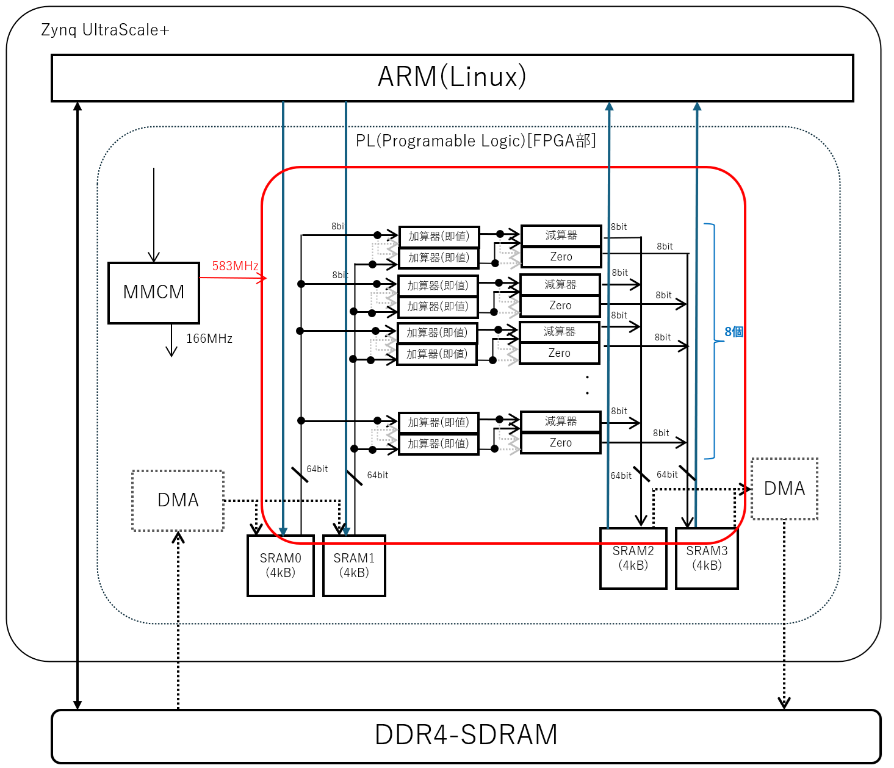

# SRAM to SRAM 2ステージ SPU サンプル

## 概要

Elixir から生成したコードをコマンドラインで合成まで行って、合成結果のレポートを得る手順を実験するためのサンプル。

下記のブロック図のような、2ステージの加算と減算の演算のサンプルである。




SPU(ストリーミング・プロセッシング・ユニット) の開発に先立って、SRAM から SRAM へのストリーム演算を
64bit幅で2入力2出六として 583MHz (KV260 の BRAMの上限を超えない生成可能最大周波数) などの高周波数で動作テストするサンプル上に実装している。

SRAM としては、Block-SRAM を利用し、暫定で Host CPU から読み書きする。

本来SRAMへは外部の DDR4-SDRAM 等から転送を行うが、SPU のみの 評価においては PS の ARM コアから読み書きを行う。

以降、本 README.md の置かれているディレクトリを基準に説明する。


## 現状の環境

現状 KV260 で 符号なし8bit 整数を 8並列(64bit)で乗算と加算を並べた実験環境である。

随時 ZCU106 なども追加予定。


## サンプルとなるコード

INT8の8並列(64bit)で (a + 2) - (b + 1) を計算する。

- [Stream Pprocessing Unit のコード](rtl/stream_processing_unit.sv)

現時点での考え方として

- 制御するARM側で、入力サイズと出力サイズが予め既知の前提
- 各演算ステージで並列に存在する演算エレメントの LATENCY は統一
- 各演算エレメントは個別モジュールとして個別にインスタンス化
- 各演算エレメントの出力は個別に変数定義されて、次のステージの演算エレメントの入力に繋がる
- 最終ステージの各演算エレメントの出力はSPUの出力に繋がる


## 事前準備

Vitis 2023.2 があらかじめ利用可能になっていること

```
source /tools/Xilinx/Vitis/2023.2/settings64.sh 
```

などを実行しておくこと。

また一部に [jelly](https://github.com/ryuz/jelly)を使う為、

```
git submodule update --recursive
```

などを実施して、サブモジュールをアップデートしておくこと。

なお、初回のみ

```
git submodule update --init --recursive
```

が必要。


## 単体のシミュレーション

```
cd sim/tb_stream_processing_unit/verilator
make
```

とすれば、SPU のみを単体でシミュレーションできる。

なお、xsim を使う場合は

```
cd sim/tb_stream_processing_unit/xsim
make
```


## KV260 にてシステム評価

### シミュレーション方法

#### verilator を使う方法

下記にて実行可能

```
cd kv260/sim/tb_top/verilator
make
```

#### xsim を使う方法

下記にて実行可能

```
cd kv260/sim/tb_top/xsim
make
```

### 合成方法

合成は Vivado の動く PC で行う。


```
cd kv260/syn/tcl
make
```

と打てば合成され  eval_spu_elixir_stage2_tcl.runs/impl_1 に eval_spu_elixir_stage2_kv260.bit が出来上がる。


### 実機実行方法

実機では SD カード上に同じ環境を clone すること。その際 submodule の update も忘れずに行う事。

まず kv260/app に eval_spu_elixir_stage2_kv260.bit をコピーする

下記のようにすればビルド後に実行される

```
cd kv260/app
make run
```

なおこの時、下記のようにオプション指定で、期待値計算を変更できる。


