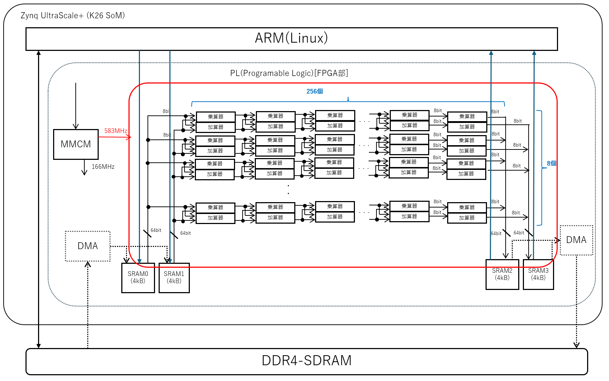

# SRAM to SRAM SPU サンプル

## 概要

SPU(ストリーミング・プロセッシング・ユニット) の開発に先立って、SRAM から SRAM へのストリーム演算を
64bit幅で2入力2出六として 500MHz 以上などの高周波数で動作テストするサンプルである。




SRAM としては、Block-SRAM などを利用する。

本来SRAMへは外部の DDR4-SDRAM 等から転送を行うが、評価においては PS の ARM コアから読み書きを行う。


## 現状の環境

現状 KV260 で 符号なし8bit 整数を 8並列(64bit)で乗算と加算を並べた実験環境である。

随時 ZCU106 なども追加予定。


## 参考にすべきコード

- [SPU相当のモジュール](rtl/stream_processing_unit.sv)
- [演算エレメント](rtl/spu_calc_element.sv)

3段パイプラインの乗算と加算を行う演算エレメントを 8 x 256 で並べるサンプルである。


## 事前準備

Vitis 2023.2 があらかじめ利用可能になっていること

```
source /tools/Xilinx/Vitis/2023.2/settings64.sh 
```

などを実行しておくこと。

また一部に [jelly](https://github.com/ryuz/jelly)を使う為、

```
git submodule update --recursive
```

などを実施して、サブモジュールをアップデートしておくこと。

なお、初回のみ

```
git submodule update --init --recursive
```

が必要。


## シミュレーション方法


### xsim を使う方法

kv260/sim/tb_top/xsim にて

```
make
```

シミュレーション時間が長いです。


### verilator を使う方法

kv260/sim/tb_top/verilator にて

```
make
```


### verilator を C++言語のテストドライバで使う方法

kv260/sim/tb_top/verilator_cpp にて

```
make
```

コンパイル時間が長いです。

## 合成方法

合成は Vivado の動く PC で行う。

kv260/syn/tcl にて

```
make
```

と打てば合成され  eval_sram_to_sram_spu_kv260_tcl.runs/impl_1 に eval_sram_to_sram_spu_kv260.bit が出来上がる。


## 実機実行方法

実機では SD カード上に同じ環境を clone すること。その際 submodule の update も忘れずに行う事。

まず kv260/app に eval_sram_to_sram_spu_kv260.bit をコピーする

eval_spu64/kv260/app にて

```
make run
```

と打てばビルド後に実行される

